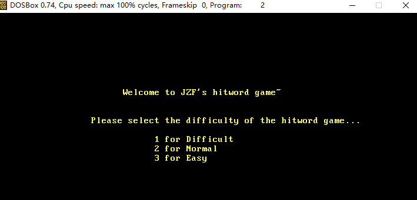
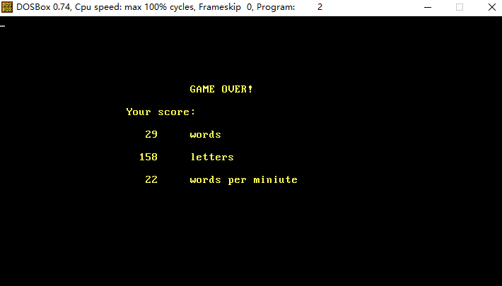

# 1. OVERVIEW
*TypingGame*, as its name reveals, is a game designed to improve one's **typing** skills, 
with randomly-generated words to be exactly typed.
When playing, one will accompanied by the melody from **Croatian Rhapsody**.
As a homework assigned in the **C program design** course for freshman majoring in CS,
it is an **individual project** for **non-comercial** purposes.
This system allows you to enjoy the funny typing game, as well as to improve your typing speed and correct ratio.

  
  
  

# 2. USAGE
Whenever a word touch the ground, game is over. Hence, please try your best to type the last word as fast as possible,
so as to avoid failure.
  
# 3. LICENSE
The content of all the codes are supposed to use a licence [AGPLv3](./LICENSE)  

# 4. HOW TO CONTRIBUTE
1. Learn what is a AGPLv3, if you have not yet done so (see details above).  
2.  Create your change to the repo in question.
- Fork the desired repo, develop and test your code changes.
- Ensure that your code is clear and comprehensible.
- Ensure that your code has an appropriate set of unit tests which all pass.
3. Submit a pull request.
4. The repo owner will review your request. If it is approved, the change will be merged. If it needs additional work, the repo owner will respond with useful comments.

# 5. CREDIT
First of all, I would like to extend my sincere gratitude to my supervisor, Jingchun Xu, for his instructive advice and useful suggestions
on my learning on C program design course.  
High tribute shall be paid to Jiang Wu, whose profound knowledge of typing game and C triggers my inspiration for this brilliant project.  
